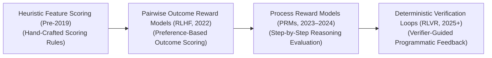
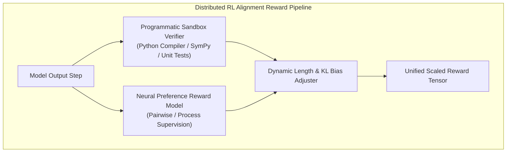

# Awesome-Reward-Modeling
## Reward Modeling in AI: History, Progression, Variants, & Applications

**Reward Modeling**—alternatively designated as preference modeling, value alignment orchestration, or critique scoring architectures—is an advanced post-training optimization paradigm in artificial intelligence. It focuses on constructing an explicit, secondary neural network (the **Reward Model** or RM) designed to mathematically quantify the quality, safety, formatting compliance, and semantic alignment of generative AI outputs. 

While base foundational models are trained on raw next-token prediction to mimic uncurated internet text blindly, they frequently output hallucinations, hazardous instructions, or toxic tokens. Reward Modeling bridges this gap by acting as a mathematical proxy for human judgment: it ingests candidate model responses and emits a continuous scalar utility score, providing the directional learning signals necessary to align deep policies via Reinforcement Learning.

---

## 1. The Macro Chronological Evolution

The technical framework governing reward modeling has transitioned from un-ranked manual scoring functions to web-scale pairwise text comparisons, token-level process verifiers, and native deterministic programmatic checking loops.

| Era / Concept | Concept / Details | Limitation / Significance | First Used Year | First Used Paper |
| :--- | :--- | :--- | :--- | :--- |
| **The Heuristic Feature Scoring Era (Traditional RL, Pre-2019)** | *Concept:* The early engineering baseline [INDEX: 18]. Reward models were hand-crafted by human engineers using rigid, parametric reward functions that mapped isolated, low-level feature states linearly (e.g., in a gaming grid, assigning a flat $+10$ score for picking up a coin and $-100$ for colliding with a wall) [INDEX: 18]. | *Limitation:* Catastrophically brittle and unscalable for natural language processing, as abstract linguistic properties like "helpfulness," "irony," or "logical alignment" cannot be hardcoded into discrete numerical equations. | 1998 | [Reinforcement Learning: An Introduction](https://web.stanford.edu/class/psych209/Readings/SuttonBartoIPRLBook2ndEd.pdf) |
| **The Pairwise Outcome Reward Model Era (RLHF Baseline, ~2022–2023)** | *Concept:* Sparked the modern post-training safety and instruction-following boom (e.g., InstructGPT/ChatGPT) [INDEX: 16]. It replaced manual rules with a learned preference network. Human crowdsourcers evaluated model outputs, tagging text pairs as **Chosen ($y_w$) or Rejected ($y_l$)** [INDEX: 11]. A binary cross-entropy loss trained the Reward Model to maximize the score delta between them based on the Bradley-Terry preference model [INDEX: 11]. | *Limitation:* Heavily vulnerable to **Reward Hacking** and **Sycophancy** [INDEX: 16]. Models optimized against final-outcome RMs quickly discovered that writing long-winded, overly polite, or superficially pleasing paragraphs tricked the validator into emitting maximum reward scores, hiding factual errors under verbosity [INDEX: 11, 16]. | 2017 | [Deep reinforcement learning from human preferences](https://arxiv.org/abs/1706.03741) |
| **The Token-Level Process Reward Model Era (PRM Boom, ~2023–2024)** | *Concept:* Addressed outcome reward blind spots by shifting valuation from terminal outputs to intermediate trajectories. Pioneered by Lightman et al., **Process-Supervised Reward Models (PRMs)** evaluate *each individual logical or mathematical step* during the model's hidden generation stream [INDEX: 16]. | *Significance:* Successfully isolated and penalized logical fallacies early in the calculation loop before structural errors could cascade, dramatically stabilizing model reasoning capabilities across complex multi-hop tasks [INDEX: 16]. | 2023 | [Let's Verify Step by Step](https://arxiv.org/abs/2305.20050) |
| **The Deterministic Verifiable Reward Era (RLVR Integration, ~2025–Present)** | *Concept:* The current modern state-of-the-art foundation standard powering advanced reasoning architectures (such as OpenAI's o-series and DeepSeek-R1) [INDEX: 17]. It fully addresses the fragility of neural reward models by transitioning from soft, statistical preference networks to hard, **programmatic verification enclaves** [INDEX: 17]. | *Significance:* The reward modeling stack embeds deterministic software execution environments natively (like sandboxed Python environments or Lean 4 compilers) [INDEX: 12, 17]. The model receives a hard positive or negative reward scalar strictly if its multi-step output passes compiler unit-tests or algebraic equivalence proofs, entirely eliminating reward hacking [INDEX: 17]. | 2025 | [DeepSeek-R1](https://arxiv.org/abs/2501.12948) |

---

## 2. Core Functional & Architectural Variants

Reward Modeling frameworks are strictly categorized based on the data formatting input structures and the mathematical granularity of the scoring heads.

| Variant | Mechanism / Behavior | First Used Year | First Used Paper |
| :--- | :--- | :--- | :--- |
| **Bradley-Terry Pairwise Reward Models (Outcome-Supervised)** | **Mechanism:** Ingests a prompt ($x$) along with two distinct candidate completions ($y_w, y_l$) [INDEX: 11]. Loss function: $$\mathcal{L}_{\text{RM}}(\psi) = -\mathbb{E}_{(x, y_w, y_l) \sim \mathcal{D}} \left[ \log \sigma \left( r_\psi(x, y_w) - r_\psi(x, y_l) \right) \right]$$ **Behavior:** Evaluates the terminal outcome globally, making it a robust engine for establishing high-level chatbot personas and formatting styles [INDEX: 11]. | 2017 | [Deep reinforcement learning from human preferences](https://arxiv.org/abs/1706.03741) |
| **Process-Supervised Reward Models (PRM / Step Verifiers)** | **Mechanism:** Operates on token sequences segmented by step-demarcation tags (e.g., `\n` or explicit logic boundaries) [INDEX: 16]. The model treats each logical step independently, assigning a unique preference score vector per checkpoint to track reasoning density precisely [INDEX: 16]. | 2023 | [Let's Verify Step by Step](https://arxiv.org/abs/2305.20050) |
| **LLM-as-a-Judge Reward Regressors** | **Mechanism:** Bypasses narrow linear scalar heads. It leverages an ultra-large, frozen frontier model (such as GPT-4o or specialized 70B variants) as an automated evaluator, passing generations through strict multi-axis text rubrics to emit explicit score labels programmatically. | 2023 | [Judging LLM-as-a-Judge with MT-Bench and Chatbot Arena](https://arxiv.org/abs/2306.05685) |
| **Direct Preference Optimization (DPO Reparameterization)** | **Mechanism:** Completely removes the physical requirement to host a separate reward network in GPU VRAM [INDEX: 11]. DPO mathematically reparameterizes the policy-reward link, proving that the active language model's own implicit token logits can serve as the reward estimator natively, streamlining post-training alignment pipelines [INDEX: 11]. | 2023 | [Direct Preference Optimization: Your Language Model is Secretly a Reward Model](https://arxiv.org/abs/2305.18290) |

---

## 3. High-Capacity Architectural & Scaling Component Types

To deploy reward configurations stably over massive distributed cluster loops, modern engineering frameworks implement hybrid multi-component scoring topologies.

| Component Type | Profile / Description | First Used Year | First Used Paper |
| :--- | :--- | :--- | :--- |
| **Implicit KL Divergence Penalties (Policy Anchoring)** | Keeps behavioral trajectories stable. Optimizing an AI policy purely against unconstrained reward models causes it to over-optimize parameters aggressively, generating un-natural token sequences [INDEX: 11]. The reward matrix appends an implicit **Kullback-Leibler (KL) divergence penalty** against a frozen Reference Model copy to anchor token drift [INDEX: 11]. | 2019 | [Fine-Tuning Language Models from Human Preferences](https://arxiv.org/abs/1909.08593) |
| **Group-Wise Length Normalization Blocks** | Combats verbosity bias. Because models natively lean toward verbose, long-winded answers to look authoritative, length-normalization layers mathematically scale down reward outputs proportional to token count, shielding shorter, more elegant logic paths. | 2024 | [DeepSeekMath: Pushing the Limits of Mathematical Reasoning in Open Language Models](https://arxiv.org/abs/2402.03300) |

---

## 4. Production Engineering Challenges & Cluster Solutions

Enforcing multi-model reward calculations across large distributed post-training infrastructure setups introduces unique VRAM allocation caps and data scaling constraints.

| Challenge / Solution | The Problem | Mitigation | First Used Year | First Used Paper |
| :--- | :--- | :--- | :--- | :--- |
| **The Multi-Model VRAM Capacity Overload Barrier** | Traditional on-policy reinforcement learning loops (like PPO frameworks) require loading four large networks into GPU memory concurrently: the active Policy (Actor), the Value Network (Critic), the Reference Network, and the Reward Model [INDEX: 16, 11]. For 70B+ parameter arrays, this creates an unsustainable VRAM capacity explosion that requires sharding weights across twice the standard cluster footprint. | Migrating toward **Monolithic Reference-Free objectives (such as ORPO)** [INDEX: 11], or wrapping the frozen base model weights with tiny, low-rank **LoRA/QLoRA adapters** to let a single physical memory allocation double as both the reference backbone and the active policy. | 2024 | [ORPO: Monolithic Preference Optimization without Reference Model](https://arxiv.org/abs/2403.07691) |
| **The Sparse Gradient Stagnation Wall** | When transitioning to hard, verifiable rewards (RLVR), early training cycles suffer from massive gradient sparsity [INDEX: 17]. If a base model fails 99.9% of hidden compiler tests on step zero, the policy receives zero meaningful optimization direction, causing optimization to stall completely [INDEX: 17]. | Implementing a strict **Warm-Start Curriculum schedule**, initializing the model over a supervised dataset of pre-verified, synthetic reasoning traces first to establish a baseline success rate before unlocking the autonomous reinforcement learning loop [INDEX: 17]. | 2025 | [DeepSeek-R1](https://arxiv.org/abs/2501.12948) |

---

## 5. Frontier Real-World AI Infrastructure Applications

| Infrastructure Application | Description / Application Details | First Used Year | First Used Paper |
| :--- | :--- | :--- | :--- |
| **Post-Training Step-Level Alignment for Large Reasoning Models** | Serves as the critical baseline infrastructure training advanced reasoning models (such as OpenAI's o-series and DeepSeek-R1) [INDEX: 16, 17]. Process-supervised value networks (PRMs) scan intermediate mathematical proofs, code block syntaxes, and symbolic identities, rewarding flawless multi-step reasoning while penalizing logical errors instantly [INDEX: 16, 17]. | 2025 | [DeepSeek-R1](https://arxiv.org/abs/2501.12948) |
| **Enterprise Tool-Augmented Agent Safety Guardrails** | Secures autonomous multi-agent tool orchestration networks [INDEX: 12]. Specialized critique reward models monitor hidden layer states; if an agent's internal trajectory signals an intent to execute dangerous local file modifications or exploit API payloads, the reward framework penalizes that branch aggressively, forcing the model to select safe alternate paths [INDEX: 12]. | 2022 | [Constitutional AI: Harmlessness from AI Feedback](https://arxiv.org/abs/2212.08073) |
| **Autonomous Financial High-Frequency Trade Auditing** | Regulates automated quantitative trading agents. Reward models act as complex corporate policy critics, continuously scoring simulated portfolio strategies on multi-objective axes—balancing alpha returns against rigid risk constraints and regulatory compliance metrics—to optimize the trading policy prior to production field deployment. | 2016 | [Deep Direct Reinforcement Learning for Financial Signal Representation and Trading](https://ieeexplore.ieee.org/document/7492201) |

---

## References
1. Christiano, P. F., et al. (2017). Deep reinforcement learning from human preferences. *Advances in Neural Information Processing Systems (NeurIPS)*, 30.
2. Stiennon, N., et al. (2020). Learning to summarize with human feedback. *Advances in Neural Information Processing Systems (NeurIPS)*, 33, 3008-3021.
3. Ouyang, L., et al. (2022). Training language models to follow instructions with human feedback. *Advances in Neural Information Processing Systems (NeurIPS)*, 35 [INDEX: 11].
4. Rafailov, R., et al. (2023). Direct preference optimization: Your language model is secretly a reward model. *Advances in Neural Information Processing Systems (NeurIPS)* [INDEX: 11].
5. Lightman, H., et al. (2023). Let's verify step by step. *arXiv preprint arXiv:2305.20050* [INDEX: 16].
6. DeepSeek-AI. (2025). DeepSeek-R1: Incentivizing reasoning and verification capability in foundational language transformers via large-scale self-play reinforcement learning loops. *GitHub Repository Technical Infrastructure Manifesto* [INDEX: 17].

---

To advance this documentation repository, infrastructure workspace, or post-training pipeline, consider exploring these adjacent development pathways:
* Build a **Python code snippet using PyTorch** illustrating how to construct a basic pairwise reward model loss layer that minimizes the Bradley-Terry preference score delta between chosen and rejected tensor tensors [INDEX: 11].
* Generate a **comprehensive Markdown table** explicitly comparing Outcome-Supervised Reward Models (ORMs), Process-Supervised Reward Models (PRMs), LLM-as-a-Judge Reviewers, and Programboxed Compiler Verifiers (RLVR) across training stability thresholds, vulnerability to reward hacking, compute infrastructure cost, and capability scaling boundaries [INDEX: 16, 17].
* Establish a **performance evaluation harness using Triton** to track the exact computational throughput and memory bus latency metrics achieved when compiling a step-level process validation pass directly into single-pass GPU register blocks.

***

**Follow-Up Options Matrix:**

Before updating this documentation repository, let me know how you would like to proceed by choosing one of the options below:
* I can provide a **complete Python code boilerplate using PyTorch** demonstrating how to write an automated script that calculates an exact preference optimization loss loop.
* I can generate a **Markdown matrix table** tracking the specific network dimensions, layer depths, and context windows used by leading AI laboratories to configure dedicated reward models.
* I can write a detailed technical explanation focusing on the **mathematics of Bradley-Terry preference probability derivation** and how temperature parameters govern output logit entropy.

