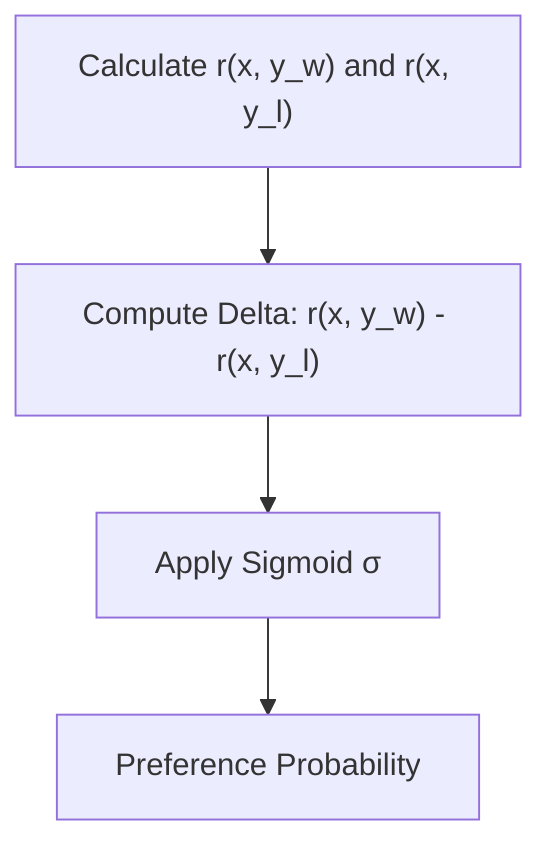

# Bradley-Terry Model

The Bradley-Terry model is a probability model for the outcome of pairwise comparisons.

## Overview
It computes the probability that completion $y_w$ is preferred to $y_l$ as:

$$P(y_w \succ y_l \mid x) = \sigma(r(x, y_w) - r(x, y_l))$$

## Key Characteristics
- **Binary Cross-Entropy Loss:** Trains model to maximize scalar difference.
- **Foundational:** Serves as the mathematical basis of RLHF.

[Back to README](../README.md)
