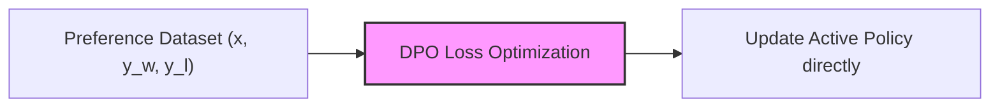

# Direct Preference Optimization (DPO)

Direct Preference Optimization (DPO) reparameterizes the RLHF objective, training the policy directly on preference data without an explicit reward model.

## Overview
DPO shows that the policy's log-ratio mathematically maps to the reward, allowing direct gradient updates.

## Key Characteristics
- **No Reward Model VRAM:** Saves massive GPU memory.
- **Reference Model Anchor:** Uses a reference model ratio to constrain drift.

[Back to README](../README.md)
