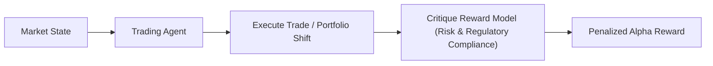

# Autonomous Financial High-Frequency Trade Auditing

Reward modeling enforces risk boundaries and policy compliance on autonomous quant trading agents.

## Overview
RL systems in finance optimize for returns (alpha) but must be constrained by risk metrics (beta, drawdown, sector limits).

## Key Characteristics
- **Multi-Objective Reward:** Balances returns against compliance bounds.
- **Pre-deployment Simulation:** Restricts training to safe risk bounds.

[Back to README](../README.md)
