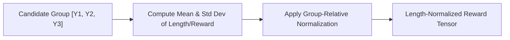

# Group-Wise Length Normalization

Group-Wise Length Normalization combats verbosity bias by penalizing overly long candidate generations relative to their group.

## Overview
Instead of rewarding absolute length, it scales or normalizes scores across a group of sampled responses.

## Key Characteristics
- **Length Neutrality:** Discourages generating conversational fillers.
- **Group-Relative:** Used in algorithms like GRPO (Group Relative Policy Optimization) to adjust step values.

[Back to README](../README.md)
