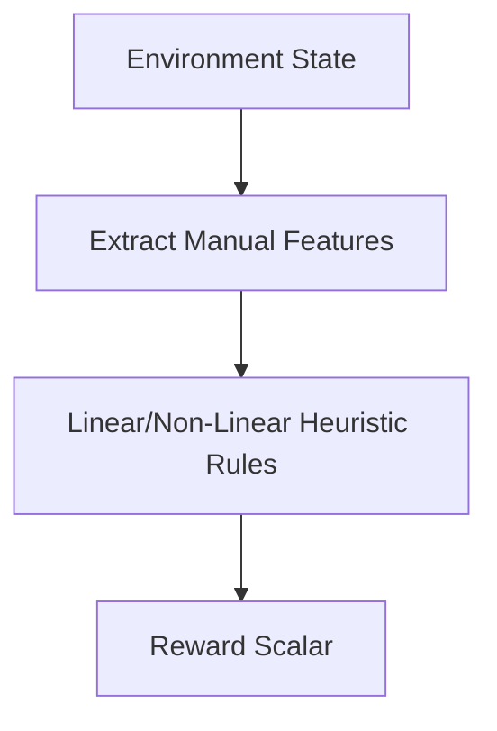

# Heuristic Feature Scoring (Traditional RL)

Heuristic feature scoring represents the foundational era of Reinforcement Learning (RL), where reward functions were manually engineered.

## Overview
Before preference learning, reward design was entirely manual. Humans defined state features and mapped them to scalar values.

## Key Characteristics
- **Manually Engineered Rules:** Flat additions/subtractions.
- **Brittle Architecture:** Fails on unseen state combinations.
- **NLP Limitations:** Abstract concepts like "helpfulness" cannot be manually coded.

[Back to README](../README.md)
