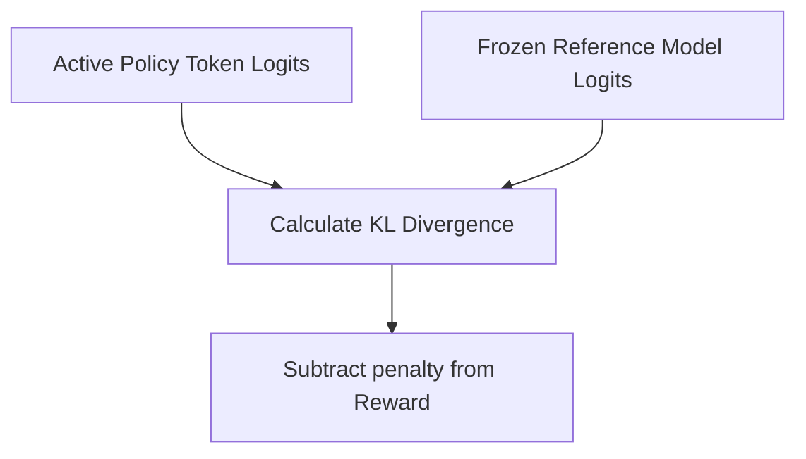

# Implicit KL Divergence Penalties

KL divergence penalties constrain policy updates to prevent the language model from diverging too far from a baseline.

## Overview
By penalizing the Kullback-Leibler divergence between the active policy and a frozen reference model, we prevent reward hacking.

## Key Characteristics
- **Policy Anchoring:** Keeps behavioral distribution stable.
- **Reduces Degeneracy:** Prevents the model from outputting repetitive gibberish that tricks the RM.

[Back to README](../README.md)
