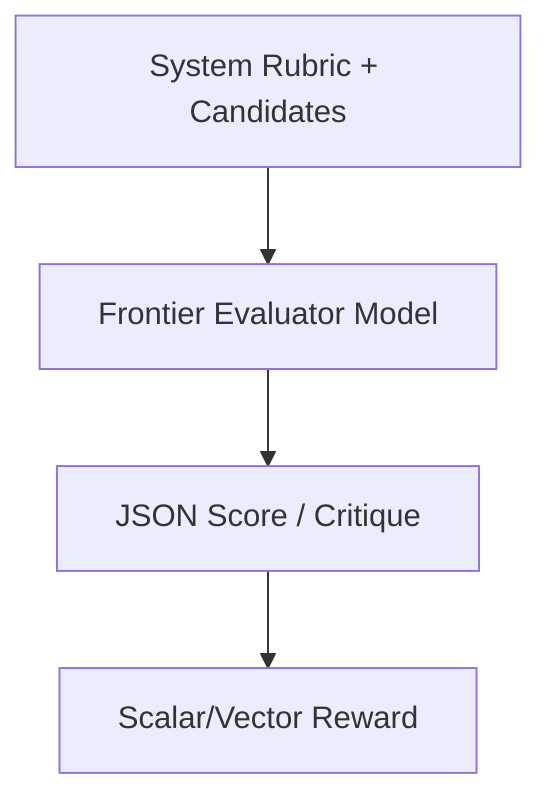

# LLM-as-a-Judge

LLM-as-a-Judge leverages large language models directly to grade outputs without training a separate regression head.

## Overview
A prompt containing strict rubrics is passed to a frontier LLM (e.g., GPT-4o) to output scores.

## Key Characteristics
- **No Training Needed:** Evaluates zero-shot using natural language instructions.
- **Multimodal capabilities:** Can grade formatting, tone, and correctness simultaneously.

[Back to README](../README.md)
