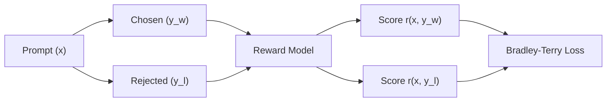

# Pairwise Outcome Reward Models

Pairwise Outcome Reward Models evaluate completion pairs globally to enforce preferences.

## Overview
This approach models human preferences by comparing a pair of candidate completions: a chosen response ($y_w$) and a rejected response ($y_l$).

## Key Characteristics
- **Pairwise Preferences:** Learns from binary comparisons.
- **Outcome-Supervised:** Evaluates the final outcome globally.
- **Limitation:** Sycophancy and verbosity bias (reward hacking).

[Back to README](../README.md)
