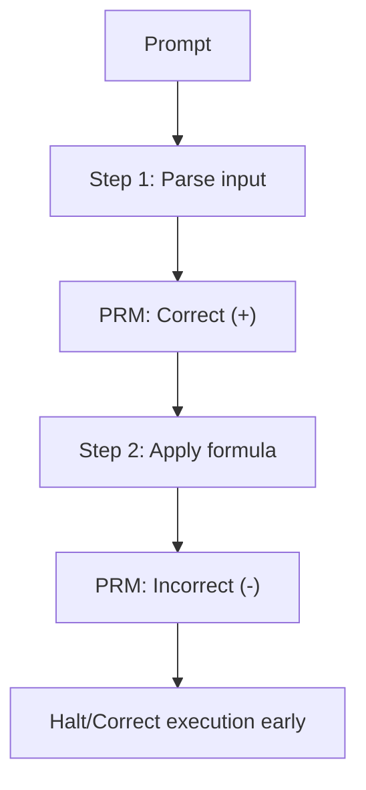

# Process Reward Models (PRMs)

Process-Supervised Reward Models evaluate individual reasoning steps rather than just the final outcome.

## Overview
Instead of giving a single reward at the end of the text generation, PRMs grade each step of the reasoning path.

## Key Characteristics
- **Step-by-Step Supervision:** Evaluates every line or reasoning checkpoint.
- **Improved Alignment:** Reduces logical fallacies and cascading errors.
- **Resource Intensive:** Requires step-level annotations.

[Back to README](../README.md)
