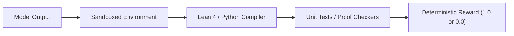

# Deterministic Verifiable Rewards (RLVR)

Deterministic Verifiable Rewards (RLVR) use hard program execution and compiler checks rather than soft neural feedback.

## Overview
RLVR integrates sandboxed compilers and unit tests to verify logic correctness programmatically.

## Key Characteristics
- **Zero Reward Hacking:** Outputs must pass compiler verification or exact equivalence test.
- **Strict Scalar Limits:** Provides binary or exact accuracy scores.
- **Reasoning Focus:** Ideal for Math, Coding, and Symbolic Logic.

[Back to README](../README.md)
