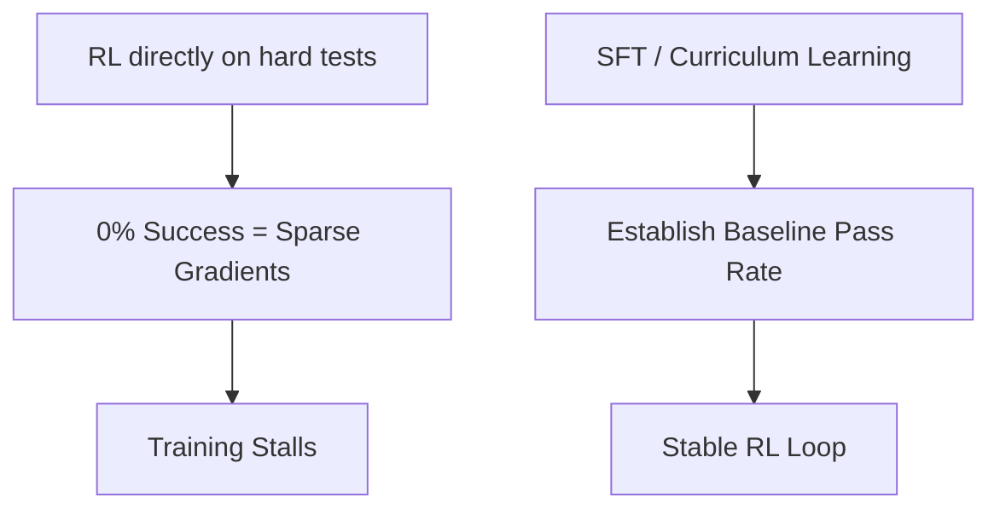

# Sparse Gradient Stagnation Wall

Sparse gradients occur in hard-verifier environments when the model fails nearly all tests early on, preventing optimization.

## Overview
A warm-start curriculum schedule or initial supervised fine-tuning (SFT) establishes a baseline pass rate before launching full RL.

## Key Characteristics
- **Curriculum Schedule:** Gradually increases test difficulty.
- **SFT Bootstrapping:** Ensures initial policy hits valid outputs.

[Back to README](../README.md)
