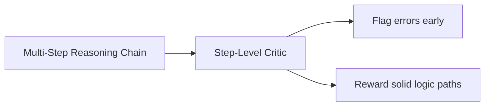

# Post-Training Step-Level Alignment (Reasoning Models)

Step-Level Alignment optimizes reasoning chains for complex STEM, coding, and mathematical tasks.

## Overview
Process-supervised models (like DeepSeek-R1 or OpenAI o-series) score intermediate steps to construct logical proofs.

## Key Characteristics
- **Stabilizes Long-Context Logic:** Keeps models on-track for 10k+ token generations.
- **Explainability:** Enables humans to inspect model reasoning.

[Back to README](../README.md)
