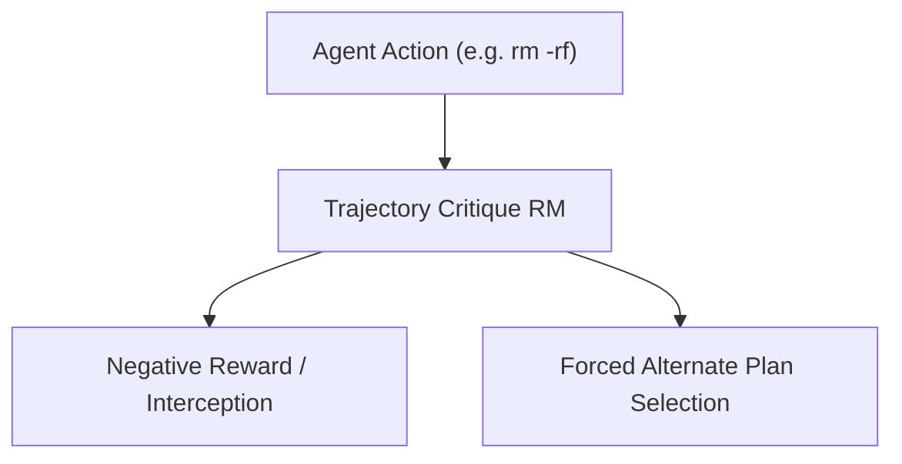

# Tool-Augmented Agent Safety Guardrails

Critique reward models secure autonomous tool orchestration environments by auditing action trajectories.

## Overview
If an agent attempts a malicious command or risky file modification, guardrail critics intercept and penalize the trajectory.

## Key Characteristics
- **Real-time Intervention:** Stops agents before executing irreversible commands.
- **Trajectory Auditing:** Looks at sequences of interactions.

[Back to README](../README.md)
