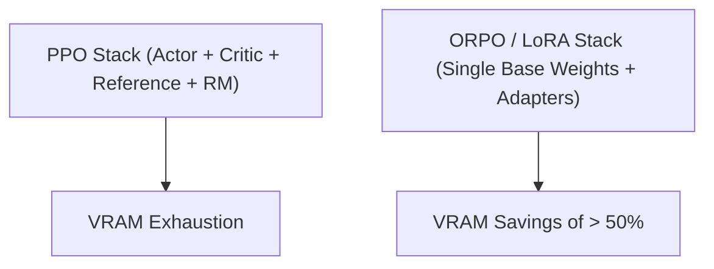

# VRAM Capacity Overload Solutions

Distributed post-training loops require loading multiple massive networks into memory, leading to GPU capacity exhaustion.

## Overview
Solutions like ORPO (reference-free optimization) or parameter-efficient fine-tuning (LoRA) bypass the multi-model bottleneck.

## Key Characteristics
- **LoRA/QLoRA Adapters:** Drastically reduces active weight footprint.
- **Reference-Free Loss:** Eliminates hosting a separate reference copy.

[Back to README](../README.md)
